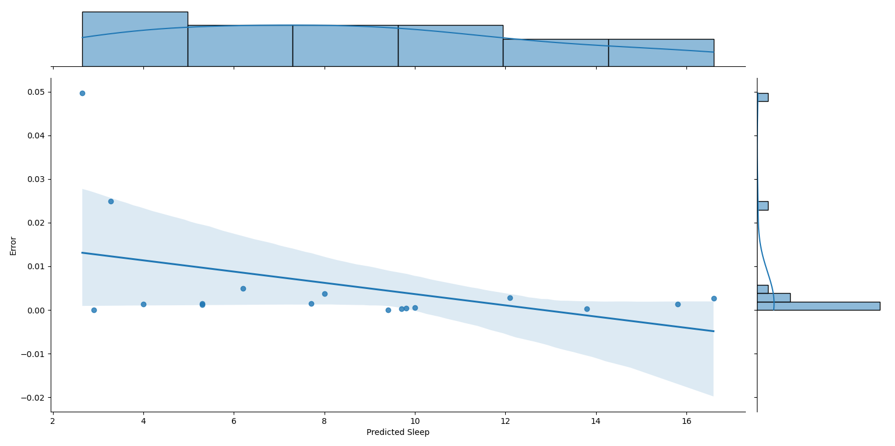

# JointPlot Sleep Prediction

A multiple linear regression model to predict sleep duration in animals, with error distribution visualized using a joint plot.

## Table of Contents
- [Project Overview](#project-overview)
- [Dataset](#dataset)
- [Requirements](#requirements)
- [Usage](#usage)
- [Project Structure](#project-structure)
- [Model Training and Evaluation](#model-training-and-evaluation)
- [Visualization](#visualization)


## Project Overview
This project aims to predict the `sleep_total` value (total sleep time) for each animal based on features such as brain and body weight, awake time, REM sleep, and dietary category. A multiple linear regression model is used to make predictions, and results are visualized to understand the error distribution.

## Dataset
The dataset used is **msleep.csv**, containing information about various animals and their sleep characteristics. Key features used include:
- **vore**: Dietary category (carnivore, herbivore, omnivore, insectivore)
- **brainwt**: Brain weight
- **bodywt**: Body weight
- **sleep_rem**: REM sleep
- **awake**: Awake time

## Requirements
- Python 3.x
- Pandas
- NumPy
- Matplotlib
- Seaborn
- scikit-learn

## Usage
1. Place your `msleep.csv` dataset in the project directory.
2. Run the main script:
    ```bash
    python main.py
    ```

This will preprocess the dataset, train the model, and produce a joint plot showing the predicted sleep durations against the prediction errors.

## Project Structure
- `main.py`: Main script to run the data processing, model training, and visualization.
- `msleep.csv`: Dataset file (add this file to the root directory).
- `README.md`: Project documentation.
- `JointPlot.png`: Example visualization of predicted sleep duration vs. prediction error.

## Model Training and Evaluation
- Missing values in the dataset are handled using mean imputation.
- `One-Hot Encoding` is applied to convert categorical features into numerical form.
- The data is split into training and test sets (80%-20% split).
- A **multiple linear regression** model is trained on the data.
- Predictions are made on the test set, and errors are calculated as the absolute difference between predicted and actual values.

## Visualization
A joint plot of predicted sleep duration vs. prediction error is generated using Seaborn to visualize the model's accuracy and error distribution.

Example:




